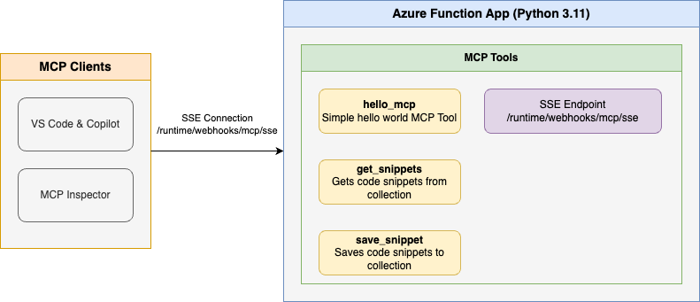

<!--
---
name: Remote MCP with Azure Functions (Python)
description: Run a remote MCP server on Azure functions.  
page_type: sample
languages:
- python
- bicep
- azdeveloper
products:
- azure-functions
- azure
urlFragment: remote-mcp-functions-python
---
-->

# Getting Started with Remote MCP Servers using Azure Functions (Python)

This is a quickstart template to easily build and deploy a custom remote MCP server to the cloud using Azure Functions with Python. You can clone/restore/run on your local machine with debugging, and `azd up` to have it in the cloud in a couple minutes. The MCP server is secured by design using keys and HTTPS, and allows more options for OAuth using built-in auth and/or [API Management](https://aka.ms/mcp-remote-apim-auth) as well as network isolation using VNET.

**Updated August 4, 2025**: This template focuses on advanced Azure infrastructure analysis tools with integrated MCP functions for server monitoring, SQL analysis, patch management, Windows and SQL best practices assessment, software configuration tracking, and performance anomaly detection.

If you're looking for this sample in more languages check out the [.NET/C#](https://github.com/Azure-Samples/remote-mcp-functions-dotnet) and [Node.js/TypeScript](https://github.com/Azure-Samples/remote-mcp-functions-typescript) versions.

[](https://codespaces.new/Azure-Samples/remote-mcp-functions-python)

Below is the architecture diagram for the Remote MCP Server using Azure Functions:



## Prerequisites

+ [Python](https://www.python.org/downloads/) version 3.11 or higher
+ [Azure Functions Core Tools](https://learn.microsoft.com/azure/azure-functions/functions-run-local?pivots=programming-language-python#install-the-azure-functions-core-tools) >= `4.0.7030`
+ [Azure Developer CLI](https://aka.ms/azd)
+ To use Visual Studio Code to run and debug locally:
  + [Visual Studio Code](https://code.visualstudio.com/)
  + [Azure Functions extension](https://marketplace.visualstudio.com/items?itemName=ms-azuretools.vscode-azurefunctions)

## Available MCP Tools

This template includes powerful MCP tools for comprehensive Azure infrastructure analysis:

### Azure Infrastructure Analysis Tools
- **GetServerMetadata** - Retrieve comprehensive server infrastructure configuration including OS version, CPU details, memory, network information, and SQL Server discovery status
- **GetSqlMetadata** - Analyze SQL Server infrastructure including database configurations, licensing, storage usage, and backup information  
- **GetPatchingLevel** - Identify missing patches and security updates across your server infrastructure with detailed metadata including KB numbers, severity, and reboot requirements
- **GetSqlBpAssessment** - Run SQL Server best practices assessment to identify configuration issues and improvement opportunities with detailed recommendations
- **GetWinBpAssessment** - Perform Windows Server best practices assessment to identify infrastructure issues and provide remediation recommendations
- **GetSwConfig** - Retrieve detailed software configuration for specific servers including installed applications, versions, and publishers
- **GetSwChangesList** - Track software configuration changes over time for specific servers to identify when applications were installed, updated, or removed
- **GetAnomalies** - Detect performance anomalies in server metrics using AI-powered analysis of CPU and disk usage patterns

These tools leverage Azure Resource Graph for infrastructure queries and Azure Monitor/Log Analytics for performance data analysis, providing comprehensive visibility into your Azure and hybrid cloud infrastructure.

## Prepare your local environment

For local development, the infrastructure analysis tools require Azure CLI authentication to access Azure Resource Graph and Monitor APIs.

1. Ensure you're logged in to Azure CLI:

    ```shell
    az login
    ```

>**Note**: The infrastructure analysis tools work with live Azure resources and require proper Azure authentication and permissions including:
> - `Microsoft.ResourceGraph/resources/read` permission for Resource Graph queries
> - `Microsoft.OperationalInsights/workspaces/query/read` permission for Log Analytics queries
> - Reader access to the subscriptions you want to analyze

## Run your MCP Server locally from the terminal

1. Change to the src folder in a new terminal window:

   ```shell
   cd src
   ```

1. Install Python dependencies:

   ```shell
   pip install -r requirements.txt
   ```

   The following Azure SDK packages are included for the infrastructure analysis tools:
   - `azure-identity` - For Azure authentication
   - `azure-mgmt-resourcegraph` - For querying Azure Resource Graph
   - `azure-monitor-query` - For Log Analytics queries
   - `azure-functions` - For Azure Functions runtime
   - `pandas` - For data processing and analysis
   - `python-dateutil` - For date/time handling

>**Note** it is a best practice to create a Virtual Environment before doing the `pip install` to avoid dependency issues/collisions, or if you are running in CodeSpaces.  See [Python Environments in VS Code](https://code.visualstudio.com/docs/python/environments#_creating-environments) for more information.

1. Start the Functions host locally:

   ```shell
   func start
   ```

> **Note** by default this will use the webhooks route: `/runtime/webhooks/mcp/sse`.  Later we will use this in Azure to set the key on client/host calls: `/runtime/webhooks/mcp/sse?code=<system_key>`

## Connect to the *local* MCP server from a client/host

### VS Code - Copilot agent mode

1. **Add MCP Server** from command palette and add URL to your running Function app's SSE endpoint:

    ```shell
    http://localhost:7071/runtime/webhooks/mcp/sse
    ```

1. **List MCP Servers** from command palette and start the server
1. In Copilot chat agent mode enter a prompt to trigger the Azure infrastructure analysis tools:

    **Server Infrastructure Analysis:**
    ```plaintext
    Get server metadata for subscription your-subscription-id
    ```

    **SQL Infrastructure Analysis:**
    ```plaintext
    Analyze SQL infrastructure configuration for subscription your-subscription-id
    ```

    **Patch Management:**
    ```plaintext
    Check for missing patches on all servers in subscription your-subscription-id
    ```

    **Best Practices Assessment:**
    ```plaintext
    Run SQL best practices assessment on workspace your-log-analytics-workspace-id for the last 30 days
    ```

    ```plaintext
    Perform Windows Server best practices assessment on workspace your-log-analytics-workspace-id
    ```

    **Software Configuration Tracking:**
    ```plaintext
    Show software configuration for server YOUR-SERVER-NAME in workspace your-log-analytics-workspace-id
    ```

    ```plaintext
    Track software changes for server YOUR-SERVER-NAME in the last 7 days using workspace your-log-analytics-workspace-id
    ```

    **Anomaly Detection:**
    ```plaintext
    Detect performance anomalies in workspace your-log-analytics-workspace-id for the last 7 days
    ```

1. When prompted to run the tool, consent by clicking **Continue**

1. When you're done, press Ctrl+C in the terminal window to stop the Functions host process.

### MCP Inspector

1. In a **new terminal window**, install and run MCP Inspector

    ```shell
    npx @modelcontextprotocol/inspector
    ```

2. CTRL click to load the MCP Inspector web app from the URL displayed by the app (e.g. http://0.0.0.0:5173/#resources)
3. Set the transport type to `SSE`
4. Set the URL to your running Function app's SSE endpoint and **Connect**:

    ```shell
    http://localhost:7071/runtime/webhooks/mcp/sse
    ```

>**Note** this step will not work in CodeSpaces.  Please move on to Deploy to Remote MCP.  

5. **List Tools**.  Click on a tool and **Run Tool**.

## Deploy to Azure for Remote MCP

Run this [azd](https://aka.ms/azd) command to provision the function app, with any required Azure resources, and deploy your code:

```shell
azd up
```

**Recent Updates (August 4, 2025):**
- Focused on Azure infrastructure analysis with comprehensive monitoring tools
- Added advanced MCP functions for server metadata, SQL analysis, patch management, and best practices assessment  
- Integrated software configuration tracking and change monitoring capabilities
- Enhanced anomaly detection for performance monitoring
- Azure SDK dependencies optimized for infrastructure analysis
- Managed identity authentication enabled for enhanced security

You can opt-in to a VNet being used in the sample. To do so, do this before `azd up`

```bash
azd env set VNET_ENABLED true
```

Additionally, [API Management]() can be used for improved security and policies over your MCP Server, and [App Service built-in authentication](https://learn.microsoft.com/azure/app-service/overview-authentication-authorization) can be used to set up your favorite OAuth provider including Entra.  

## Connect to your *remote* MCP server function app from a client

Your client will need a key in order to invoke the new hosted SSE endpoint, which will be of the form `https://<funcappname>.azurewebsites.net/runtime/webhooks/mcp/sse`. The hosted function requires a system key by default which can be obtained from the [portal](https://learn.microsoft.com/azure/azure-functions/function-keys-how-to?tabs=azure-portal) or the CLI (`az functionapp keys list --resource-group <resource_group> --name <function_app_name>`). Obtain the system key named `mcp_extension`.

### Connect to remote MCP server in MCP Inspector
For MCP Inspector, you can include the key in the URL: 
```plaintext
https://<funcappname>.azurewebsites.net/runtime/webhooks/mcp/sse?code=<your-mcp-extension-system-key>
```

### Connect to remote MCP server in VS Code - GitHub Copilot
For GitHub Copilot within VS Code, you should instead set the key as the `x-functions-key` header in `mcp.json`, and you would just use `https://<funcappname>.azurewebsites.net/runtime/webhooks/mcp/sse` for the URL. The following example uses an input and will prompt you to provide the key when you start the server from VS Code.  Note [mcp.json](.vscode/mcp.json) has already been included in this repo and will be picked up by VS Code.  Click Start on the server to be prompted for values including `functionapp-name` (in your /.azure/*/.env file) and `functions-mcp-extension-system-key` which can be obtained from CLI command above or API Keys in the portal for the Function App.  

```json
{
    "inputs": [
        {
            "type": "promptString",
            "id": "functions-mcp-extension-system-key",
            "description": "Azure Functions MCP Extension System Key",
            "password": true
        },
        {
            "type": "promptString",
            "id": "functionapp-name",
            "description": "Azure Functions App Name"
        }
    ],
    "servers": {
        "remote-mcp-function": {
            "type": "sse",
            "url": "https://${input:functionapp-name}.azurewebsites.net/runtime/webhooks/mcp/sse",
            "headers": {
                "x-functions-key": "${input:functions-mcp-extension-system-key}"
            }
        },
        "local-mcp-function": {
            "type": "sse",
            "url": "http://localhost:7071/runtime/webhooks/mcp/sse"
        }
    }
}
```

## Deployment Status and Current Configuration

The template can be deployed and configured with details similar to the following example:

- **Function App Name**: `func-api-example123`
- **Resource Group**: `rg-MyMCPProject-REGION`
- **Location**: `East US` (or your preferred region)
- **Subscription**: `your-subscription-id`

### Remote MCP Server Endpoints:
- **Production URL**: `https://your-function-app-name.azurewebsites.net/runtime/webhooks/mcp/sse`
- **Local Development URL**: `http://localhost:7071/runtime/webhooks/mcp/sse`

### Available MCP Tools (8 total):
✅ **get_server_metadata_function** - Server infrastructure analysis  
✅ **get_sql_metadata_function** - SQL Server configuration analysis  
✅ **get_patching_level_function** - Patch management and security updates  
✅ **get_sql_bp_assessment_function** - SQL Server best practices assessment  
✅ **get_win_bp_assessment_function** - Windows Server best practices assessment  
✅ **get_sw_config_function** - Software configuration tracking  
✅ **get_sw_changes_list_function** - Software change monitoring  
✅ **get_anomalies_function** - Performance anomaly detection  

### Recent Fixes Applied:
- ✅ **JSON Schema Validation**: Fixed MCP tool parameter validation errors by properly defining array type schemas with `items` specification
- ✅ **User Authentication**: Updated authentication to prioritize user credentials over managed identity for flexible authentication
- ✅ **Service Principal Setup**: Configured Azure Function with service principal credentials for user-controlled authentication
- ✅ **Code Consolidation**: Migrated from `agent_functions.py` to comprehensive `mcp_tools.py` implementation
- ✅ **Deployment**: Successfully deployed to Azure with proper function bindings and MCP integration

## Redeploy your code

You can run the `azd up` command as many times as you need to both provision your Azure resources and deploy code updates to your function app.

>[!NOTE]
>Deployed code files are always overwritten by the latest deployment package.

## Clean up resources

When you're done working with your function app and related resources, you can use this command to delete the function app and its related resources from Azure and avoid incurring any further costs:

```shell
azd down
```

## Helpful Azure Commands

Once your application is deployed, you can use these commands to manage and monitor your application:

```bash
# Get your function app name from the environment file
FUNCTION_APP_NAME=$(cat .azure/$(cat .azure/config.json | jq -r '.defaultEnvironment')/.env | grep AZURE_FUNCTION_NAME | cut -d= -f2 | tr -d '"')
echo $FUNCTION_APP_NAME

# Get resource group 
RESOURCE_GROUP=$(cat .azure/$(cat .azure/config.json | jq -r '.defaultEnvironment')/.env | grep RESOURCE_GROUP | cut -d= -f2 | tr -d '"')
echo $RESOURCE_GROUP

# Get the MCP extension system key
az functionapp keys list --resource-group $RESOURCE_GROUP --name $FUNCTION_APP_NAME --query "systemKeys.mcp_extension" -o tsv

# View function app logs
az webapp log tail --name $FUNCTION_APP_NAME --resource-group $RESOURCE_GROUP

# Redeploy the application without provisioning new resources
azd deploy
```

## Source Code

The function code for the MCP tools is defined in the Python files in the `src` directory. The MCP function annotations expose these functions as MCP Server tools.

### Core Files
- **`function_app.py`** - Main Azure Function app with MCP tool wrapper functions
- **`mcp_tools.py`** - Azure infrastructure analysis MCP tool implementations  
- **`utils/`** - Utility classes for Azure Resource Graph and Log Analytics integration
  - `resource_graph_tool.py` - Azure Resource Graph query execution
  - `log_analytics_tool.py` - Log Analytics/Azure Monitor queries
  - `logging_decorators.py` - Logging and debugging utilities
  - `log_config.py` - Conditional logging system for local development

### Logging System

The project includes an intelligent logging system that automatically adapts to the environment:

- **Local Development**: Creates timestamped log files in the `logs/` directory with all MCP tool activity consolidated into a single session file
- **Azure Functions**: Uses Azure's built-in logging infrastructure without creating local files
- **Environment Detection**: Automatically detects Azure Functions environment variables to determine logging mode
- **Session-based**: All loggers in a single execution session write to the same timestamped file for easy debugging

Example log file: `logs/mcp_session_20250804_123456_789.log`

### Example Tool Implementation

Here's an example of how the infrastructure analysis tools are implemented:

```python
@app.generic_trigger(
    arg_name="context",
    type="mcpToolTrigger",
    toolName="GetServerMetadata",
    description="Retrieve the server infrastructure configuration",
    toolProperties=tool_properties_subscription_ids_json,
)
def get_server_metadata_function(context) -> str:
    """
    Azure Function wrapper for GetServerMetadata.
    
    Args:
        context: The trigger context containing the input arguments.
        
    Returns:
        str: JSON string with server metadata.
    """
    try:
        content = json.loads(context)
        subscription_ids = content["arguments"]["subscription_ids"]
        
        # Call the mcp_tools function
        result = GetServerMetadata(subscription_ids)
        return result
    except Exception as e:
        logging.error(f"Error in get_server_metadata_function: {str(e)}")
        return result
    except Exception as e:
        logging.error(f"Error in get_server_metadata_function: {str(e)}")
        return json.dumps({"error": str(e)})
```

The underlying MCP tool function uses Azure Resource Graph to query server infrastructure:

```python
@log_function_call
def GetServerMetadata(subscription_ids) -> str:
    """Retrieve the server infrastructure configuration."""
    
    kql_query = """resources 
    | where type == 'microsoft.hybridcompute/machines' 
    | project name, type, location, resourceGroup, 
              OsVersion=properties.osSku, 
              processor=properties.detectedProperties.processorNames,
              coreCount=properties.detectedProperties.logicalCoreCount,
              RamGB=properties.detectedProperties.totalPhysicalMemoryInGigabytes,
              subnet=properties.networkProfile.networkInterfaces[0].ipAddresses[0].address,
              mssqlDiscovered=properties.mssqlDiscovered"""
    
    response = resource_graph_tool(kql_query, subscription_ids)
    return response
```

Note that the `host.json` file also includes a reference to the experimental bundle, which is required for apps using this feature:

```json
"extensionBundle": {
  "id": "Microsoft.Azure.Functions.ExtensionBundle.Experimental",
  "version": "[4.*, 5.0.0)"
}
```

## Next Steps

- Add [API Management](https://aka.ms/mcp-remote-apim-auth) to your MCP server (auth, gateway, policies, more!)
- Add [built-in auth](https://learn.microsoft.com/en-us/azure/app-service/overview-authentication-authorization) to your MCP server
- Enable VNET using VNET_ENABLED=true flag
- Learn more about [related MCP efforts from Microsoft](https://github.com/microsoft/mcp/tree/main/Resources)

## Changelog

### August 4, 2025 - Latest Updates
- **JSON Schema Validation Fix**: Resolved MCP tool validation errors by implementing proper array type definitions with `items` specification in tool properties
- **Authentication Enhancement**: Updated ResourceGraphTool class to support credential injection for improved Azure authentication flexibility
- **Code Architecture Improvement**: Successfully migrated from legacy `agent_functions.py` to consolidated `mcp_tools.py` with all 8 infrastructure analysis tools
- **Deployment Optimization**: Completed successful Azure deployment with automated resource provisioning
- **MCP Configuration**: Enhanced `.vscode/mcp.json` to support both local and remote MCP server configurations
- **Documentation Update**: Comprehensive README refresh with current deployment details, connection examples, and troubleshooting guidance

### August 4, 2025 - Core Template Updates
- **Focused on Azure Infrastructure Analysis**: Streamlined the template to focus exclusively on powerful Azure infrastructure monitoring and analysis tools
- **Enhanced MCP Tool Suite**: Now includes 8 comprehensive MCP tools for infrastructure analysis:
  - Server metadata and configuration analysis
  - SQL Server infrastructure and database monitoring  
  - Patch management and security update tracking
  - Windows and SQL best practices assessments
  - Software configuration tracking and change monitoring
  - Performance anomaly detection with AI-powered analysis
- **Improved Security**: Implemented Azure CLI authentication for Resource Graph and Monitor API access
- **Optimized Dependencies**: Updated Azure SDK packages for Resource Graph, Monitor APIs, and data processing
- **Enhanced Documentation**: Comprehensive tool descriptions, usage examples, and architectural guidance
- **Code Refactoring**: Consolidated agent functions into `mcp_tools.py` with improved error handling and logging

### Removed Features:
- Basic snippet management tools (hello_mcp, get_snippet, save_snippet) 
- Azure Blob Storage dependencies for snippet functionality
- Local Azurite storage emulator requirements
